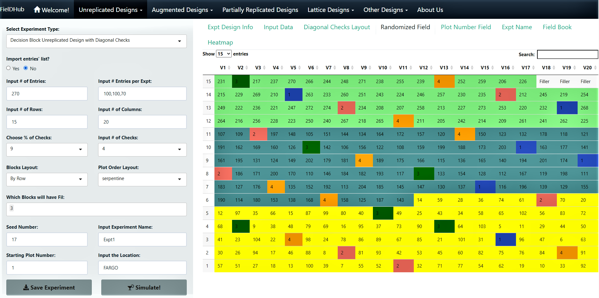

# Summary

`FielDHub` is an R Shiny design of experiments (DOE) app that aids in the creation of traditional, unreplicated, augmented and partially-replicated [@Cullis2006_cit] designs  applied to agriculture, plant breeding, forestry, animal and biological sciences. One of the problems that life scientists often face is the lack of freely available and user-friendly interactive tools to create designs that fit their needs. A few open-source DOE R packages options exist including agricolae [@agricolae_cit] and blocksdesign [@blocksdesign_cit], but they require users to be familiar with the R programming language and do not have a graphical user interface (GUI).

# Statement of need

`FielDHub` allows users to perform randomizations of field, laboratory, and greenhouse experiments, while providing output via interactive field layouts and tables that can be extracted and saved. This app has a novel design that offers DOE options and features that are not currently available in most software applications.  Users are guided in each step of the DOE platform in an interactive interface, which includes a feature that helps to generate randomizations with an option to simulate data for a response variable. This last feature makes it suitable for teaching and evaluation purposes, where instructors can use the graphical dynamic user interface and/or use the functions included in the R package for teaching R scripting courses. This app also provides a graphical workflow to import treatment lists and export field books. For field experiments with a strict spatial arrangement, it allows users to specify the dimensions of the field (the number of rows and columns), while controlling the percentage of check plots, and obtaining field maps and field books that can be used directly as templates and input files for centralized databases.

`FielDHub` is currently being used by different breeding programs at NDSU and in graduate courses to teach the concepts of randomization, blocking, replication and simulations. The combination, in a single application, of novel and traditional designs, an interactive user interface, visualizations, and generation of templates and field layouts will enable the discovery of outstanding genotypes, while using efficient experimental designs that meet the requirements of the research being conducted.

Some of the features and designs implemented in `FielDHub` are summarized below:

1. Novel Designs: `FielDHub` has implemented a class of experimental designs known as augmented designs, partially replicated, and unreplicated designs. Examples are provided for each of the options with a default input data to demonstrate the functionalities of the app.

2. Reactive Interface: `FielDHub` provides output via an interactive interface, where users enter values that automatically generate tables, layouts, and output files within seconds.

3. Modularization: `FielDHub` was built in Shiny modules using the golem framework [@golem_cit]. Modularity makes the app easy to test, maintain, and deploy. 

4. Local and Remote Deployment: `FielDHub` can be deployed either to a local computer or to a server for online use. Currently it has been used within a server instance that has been utilized by graduate students and researchers alike in NDSU.

5. Simulations: `FielDHub` allows users to simulate a response variable along with the randomization. This feature can be used to define the corresponding linear model and to assess the efficiency of the experimental design, particularly in relation to its spatial components, or it can also be used to teach statistical concepts.

 Fig 1. Overview of `FielDHub` main features.

# Usage

Plant breeding field research projects at NDSU are using `FielDHub` to refine experimental techniques in order to obtain unbiased and more precise estimates of the true treatment effects and their differences using unreplicated designs [@estefanova_cit; @Federer_cit]. Often these projects face limitations of seed quantity and available field space in conducting trials with large numbers of genotypes and opt for the use of partially replicated or unreplicated designs [@estefanova_cit]. As an example (Fig. 2), we consider here 270 genotypes arranged in a field of 15 rows by 20 columns. These genotypes are grouped in three different experiments/sites. In addition, we used four checks that are replicated in a systematic diagonal arrangement to fill 27 plots that represent 9% of the total experimental plots. An option to include filler plots is also available.

 Fig 2. Unreplicated design with checks in a systematic diagonal arrangement. 

# Acknowledgments

This application was developed as part of a collaboration between North Dakota State University (ND, USA), VSN International (Hemel Hempstead, UK) and CIAT (Cali, Colombia). The authors want to express the support from their respective institutions for allowing us to dedicate time to this exciting product. Special thanks to Dr. Blaine Johnson and Dr. Andrew Green for their useful contributions. 

# Availability and Community Guidelines

The software is available at the [GitHub](https://github.com/DidierMurilloF/FielDHub/) repository. The GitHub repository also contains the source code for this paper. Users and contributors are welcome to contribute, request features, and report bugs in this GitHub repository.

# References
